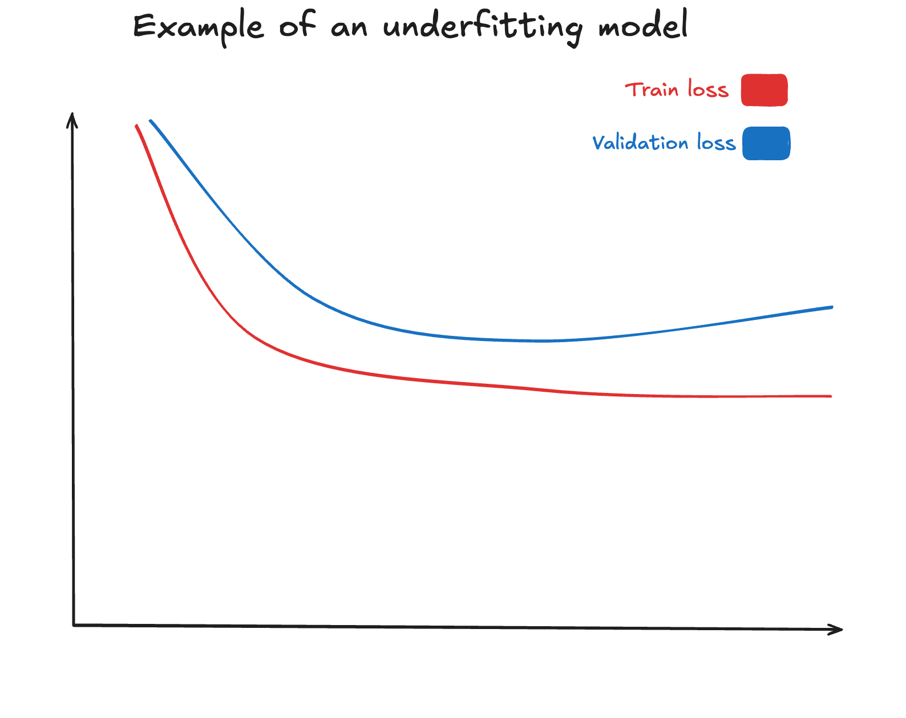
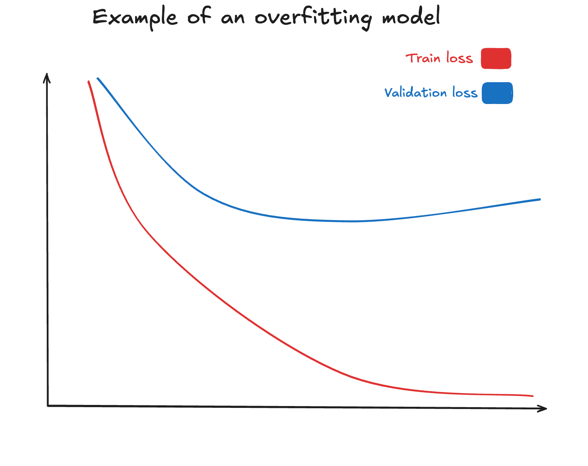
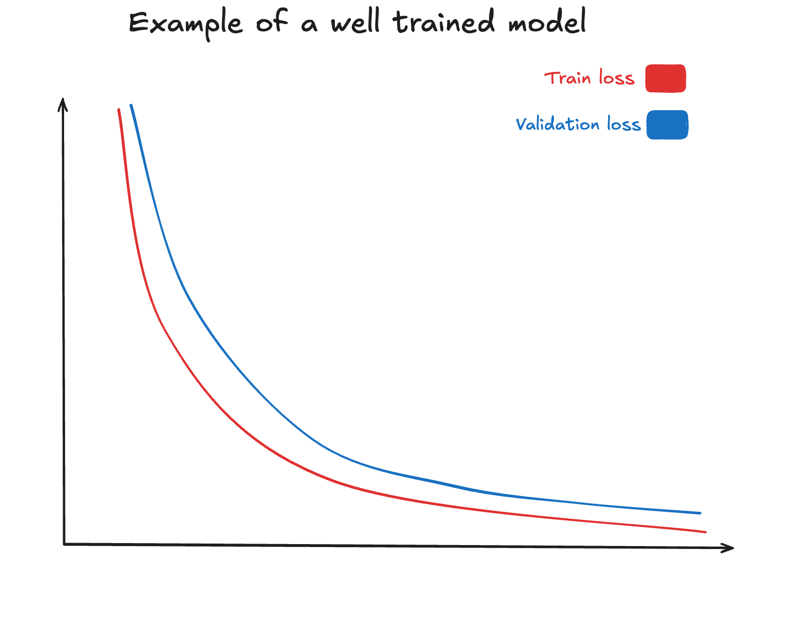

---

[⬅️ Previous - Fine-tuning with TRL's SFTTrainer + PEFT for LoRA/QLoRA](https://app.readytensor.ai/publications/sft)
[➡️ Next - Multi-GPU Training for Fine-Tuning LLMs](https://app.readytensor.ai/publications/multi-gpu)

---

## TL;DR

Effective evaluation during fine-tuning requires three key practices: **First**, monitor training and validation loss curves to identify underfitting (both losses stay high) or overfitting (training drops while validation rises). **Second**, run qualitative checks with sample prompts at regular intervals—loss numbers can mislead, but actual outputs reveal whether responses improve in coherence and relevance. **Third**, implement early stopping with patience parameters to halt training when validation performance plateaus, preventing wasted compute and overfitting. Together, these create a robust monitoring system that keeps fine-tuning efficient and aligned with your goals.


## What You'll Learn in This Lesson

By the end of this lesson, you will have practical skills to monitor and evaluate your fine-tuning progress effectively:

- **Interpret loss curves** to diagnose training issues and identify underfitting/overfitting patterns
- **Implement systematic prompt-based evaluation** to verify real-world performance beyond metrics
- **Configure early stopping** to optimize training efficiency and prevent overfitting
- **Combine quantitative and qualitative assessment** to ensure your model learns what you want, not just what reduces loss


## Monitoring Training and Validation Loss

One of the most reliable ways to evaluate your fine-tuning process is by tracking the training and validation loss curves. These curves provide an objective view of how well your model is learning and whether it is generalizing to unseen data. Training loss measures how well the model fits the data it has already seen, while validation loss indicates how well it performs on held-out data. By plotting both over time, you can spot patterns that reveal whether your model is learning steadily, underfitting, or overfitting. Without this step, it is easy to assume that a decreasing training loss means success—when in reality, the model might simply be memorizing the dataset rather than generalizing beyond it.


When you inspect these plots, look for key patterns. If both training and validation losses decrease steadily, the model is learning effectively. If training loss continues to drop while validation loss rises, this is a classic sign of overfitting—your model is memorizing the training data at the expense of generalization. On the other hand, if both curves remain flat and high, the model is underfitting, meaning it lacks capacity or training time to learn useful patterns. By regularly plotting these curves, you gain a powerful diagnostic tool that guides when to adjust hyperparameters, stop training, or even rethink your dataset strategy.

### Identifying Underfitting Patterns



Underfitting shows several characteristic patterns in loss curves:

- **Both curves remain high**: Training and validation loss stay elevated throughout training
- **Minimal improvement**: Loss decreases very slowly or hardly at all
- **Parallel curves**: Training and validation losses track closely together, with both remaining high
- **Early plateau**: Loss curves flatten out at a high value early in training

When you see these patterns, consider these remedies:
- **Train longer**: Increase the number of epochs to give the model more time to learn
- **Increase model capacity**: Use a larger model or add more parameters
- **Optimize learning rate**: Try higher learning rates to escape local minima
- **Reduce regularization**: Lower dropout rates or weight decay if they're being used
- **Improve data quality**: Check if your training data contains sufficient signal

### Recognizing Overfitting Patterns



Overfitting displays these telltale signs:

- **Diverging curves**: Training loss continues to decrease while validation loss begins to increase
- **Growing gap**: The difference between training and validation loss grows larger over time
- **Validation U-curve**: Validation loss initially decreases, reaches a minimum, then starts rising
- **Training approaching zero**: Training loss approaches zero while validation loss remains higher

When overfitting occurs, try these strategies:
- **Early stopping**: Halt training when validation loss starts to increase
- **Add regularization**: Introduce or increase dropout, weight decay, or gradient clipping
- **Data augmentation**: Expand your training data with variations to improve generalization
- **Reduce model size**: Consider using a smaller model or adding constraints
- **Increase training diversity**: Ensure your dataset contains sufficient variety

In language model fine-tuning, these patterns may manifest differently depending on the specific task and model architecture. For instance, encoder-only models used for classification might show more pronounced overfitting than decoder-only models used for generation tasks. The key is to establish your baseline early and watch for relative changes in the relationship between training and validation curves.

### The Optimal Training Pattern



The ideal training scenario shows a very different pattern from both underfitting and overfitting:

- **Both curves decrease together**: Training and validation losses both decline steadily throughout training
- **Curves stay close**: The gap between training and validation loss remains small and consistent
- **Smooth convergence**: Both losses gradually flatten out at low values, indicating the model has learned effectively
- **Stable plateau**: After convergence, both losses remain stable without diverging

**Key indicators of optimal training:**
- Validation loss closely follows training loss with only a small, consistent gap
- Both losses reach a stable minimum without wild fluctuations
- The model generalizes well (low validation loss) while still fitting the training data (low training loss)
- Training can be stopped when both curves plateau, indicating the model has learned as much as possible from the data

This is the sweet spot you're aiming for - a model that has learned the underlying patterns in your data without memorizing noise or failing to capture important relationships. When you see this pattern, you can be confident that your model will perform well on new, unseen examples.

## Qualitative Checks with Sample Prompts

While monitoring loss curves is essential, numbers alone do not always tell the full story. A model may achieve a low validation loss, but still produce outputs that are repetitive, irrelevant, or simply not useful in practice. This is why it is important to complement quantitative tracking with qualitative checks. By feeding a few representative prompts to your model at regular checkpoints, you gain an intuitive sense of how its responses are evolving across training. These quick checks often reveal issues—such as poor coherence, hallucinations, or lack of style adaptation—that raw loss values would not capture.

A simple way to implement this is by selecting a small set of sample prompts that reflect your dataset’s purpose. For example, if you are fine-tuning a chatbot on customer support data, you might prepare a list of typical user queries. At the end of each epoch (or every few epochs), you can generate responses for these fixed prompts and compare them across checkpoints. Over time, you should see the answers becoming more relevant, structured, and aligned with your desired output style.


## Early Stopping Strategies

Even with careful monitoring of training and validation loss, it is easy to let training run longer than necessary. This can lead to wasted compute and, more importantly, overfitting—where the model continues to improve on training data but performs worse on unseen validation examples. Early stopping provides a simple yet powerful safeguard against this. The idea is straightforward: stop training once the validation loss stops improving for a given number of consecutive evaluation steps.

In practice, early stopping uses a **patience** parameter, which defines how many evaluations to wait before halting if no improvement is observed. For example, if `patience=2`, training will end if validation loss does not improve for two evaluations in a row. Hugging Face's Trainer makes this incredibly simple with the built-in `EarlyStoppingCallback`.

### Configuration Setup

First, add early stopping configuration to your `config.json`:

```json
{
    "early_stopping": {
        "early_stopping_patience": 2,
        "early_stopping_threshold": 0.05
    }
}
```

### Implementation in Code

Then implement it in your training script:

```python
from transformers import Trainer, EarlyStoppingCallback

# Load early stopping config
early_stopping_config = config.get("early_stopping", {})

# Create callback if config exists
callbacks = []
if early_stopping_config:
    callbacks.append(EarlyStoppingCallback(**early_stopping_config))

# Setup trainer with early stopping
trainer = Trainer(
    model=model,
    args=training_args,
    train_dataset=train_dataset,
    eval_dataset=eval_dataset,
    data_collator=data_collator,
    callbacks=callbacks
)

trainer.train()
```

### Key Parameters

- **`early_stopping_patience`**: Number of evaluations to wait without improvement (typically 2-5)
- **`early_stopping_threshold`**: Minimum improvement required to reset patience counter (e.g., 0.05)

With this setup, training automatically stops when validation loss plateaus, saving compute resources and preventing overfitting. The trainer will automatically load the best checkpoint at the end, ensuring you get the optimal model without manual intervention.

## Common Pitfalls and Debugging Tips

Even when you have the right evaluation tools in place, there are several common mistakes that can lead to misleading results or wasted effort. Being aware of these pitfalls helps you interpret your training progress more accurately and avoid unnecessary frustration.

### Overreliance on Training Loss

A frequent mistake is **relying only on training loss**. While a steadily decreasing training loss may look encouraging, it says nothing about how well the model generalizes to unseen data. Without checking validation loss, you may completely miss overfitting—where the model memorizes the training set and fails on real-world inputs. Always evaluate both training and validation curves together to get the full picture.

### Limited Qualitative Evaluation

Another issue arises from **using too few qualitative prompts**. If you only test with one or two hand-picked examples, you may get a false signal of improvement. The model might perform well on those specific prompts but still generate poor outputs elsewhere. To avoid this, prepare a small but diverse set of evaluation prompts that reflect the actual variety of inputs your model will face in practice. This way, your qualitative checks remain a reliable complement to numerical metrics.

### Premature Stopping Due to Noisy Validation

There is the risk of **stopping too early** when validation loss appears to fluctuate. Small oscillations are normal and do not necessarily mean the model has stopped improving. If you halt training at the first sign of noise, you may miss the opportunity for the model to converge further. This is why early stopping strategies typically include a patience parameter—so you wait a few evaluations before making the decision to stop. Balancing responsiveness with patience ensures that you neither overtrain nor cut off training prematurely.

### Addressing Persistent Underfitting

When dealing with a model that's consistently underfitting, consider these targeted approaches:

1. **Hyperparameter Sweep**: Systematically explore learning rates (often 1e-5 to 5e-5 for fine-tuning), batch sizes (try 4, 8, 16), and optimizer settings
2. **Training Duration**: For complex tasks, models may need significantly more training time; increase epochs by 2-3x
3. **Model Scale**: If resources permit, move to a larger model variant; scaling often helps with underfitting
4. **Learning Rate Scheduling**: Implement warm-up periods and learning rate decay to help find optimal parameter values
5. **Evaluate Data Quality**: Verify your dataset contains meaningful signal and sufficient examples of desired behavior

If underfitting persists despite these interventions, it may indicate a fundamental mismatch between your task complexity and model capabilities, or issues with your training data quality.

### Combating Overfitting Effectively

For overfitting issues that arise during fine-tuning, try these specialized techniques:

1. **Targeted Regularization**: For language models, consider:
   - Parameter-efficient fine-tuning methods like LoRA (low-rank adaptation)
   - Selective layer freezing (keeping earlier layers fixed)
   - Gradient clipping to prevent extreme parameter updates

2. **Dataset Improvements**:
   - Increase training data diversity
   - Remove duplicates and near-duplicates
   - Apply data augmentation techniques like paraphrasing or prompt reformulation
   - Ensure validation set properly represents inference scenarios

3. **Training Adjustments**:
   - Implement proper early stopping with patience of 3-5 evaluation steps
   - Use learning rate decay schedules that reduce learning as training progresses
   - Consider mixed precision training which sometimes improves generalization
   - Try smaller batch sizes which can reduce overfitting in some cases

4. **Cross-Validation**: For smaller datasets, implement k-fold cross-validation to get a more reliable estimate of generalization performance

By keeping these pitfalls in mind and applying the appropriate remedies, you can troubleshoot more effectively and maintain confidence that your evaluation setup is guiding your training in the right direction. Remember that fine-tuning language models is often an iterative process – the insights from one experiment should inform the design of the next until you achieve the desired balance between fitting your training data and generalizing to new examples.

## Practical Implementation Guide

Now that you understand the concepts, here's a complete implementation guide you can apply directly to your fine-tuning projects. This section provides ready-to-use code and practical workflows.

### Sample Prompt Evaluation Script

Create a simple script to test your model at different checkpoints:

```python
def evaluate_sample_prompts(model, tokenizer, prompts, checkpoint_name):
    """Evaluate model on sample prompts and save results."""
    results = []
    
    for prompt in prompts:
        inputs = tokenizer(prompt, return_tensors="pt", truncation=True)
        
        with torch.no_grad():
            outputs = model.generate(
                **inputs,
                max_new_tokens=100,
                temperature=0.7,
                do_sample=True,
                pad_token_id=tokenizer.eos_token_id
            )
        
        response = tokenizer.decode(outputs[0][inputs['input_ids'].shape[1]:], 
                                  skip_special_tokens=True)
        results.append({"prompt": prompt, "response": response})
    
    # Save results
    with open(f"eval_results_{checkpoint_name}.json", "w") as f:
        json.dump(results, f, indent=2)
    
    return results

# Example usage
sample_prompts = [
    "How do I reset my password?",
    "What are your business hours?", 
    "I need help with my order."
]

# Run evaluation at different checkpoints
evaluate_sample_prompts(model, tokenizer, sample_prompts, "final")
```

### Quick Troubleshooting Checklist

When your training isn't going as expected, use this checklist:

**If validation loss is not improving:**
- [ ] Check if `eval_strategy="epoch"` is set
- [ ] Verify validation dataset is not empty
- [ ] Ensure early stopping patience isn't too low (try 3-5)
- [ ] Increase early stopping threshold (try 0.05-0.1)

**If both losses stay high (underfitting):**
- [ ] Increase learning rate (try 1e-4 to 5e-4)
- [ ] Train for more epochs
- [ ] Reduce regularization (lower dropout)
- [ ] Check data quality and preprocessing

**If training loss drops but validation rises (overfitting):**
- [ ] Enable early stopping
- [ ] Reduce learning rate
- [ ] Add more training data
- [ ] Increase regularization

**For unstable training:**
- [ ] Enable gradient clipping (`max_grad_norm=1.0`)
- [ ] Use learning rate warmup
- [ ] Check for data quality issues
- [ ] Reduce batch size if memory allows

This systematic approach helps you quickly identify and resolve common training issues, making your fine-tuning process more reliable and efficient.

## 🎥 Video: Evaluation in Action

*[VIDEO PLACEHOLDER - This section will contain a comprehensive demonstration showing:]*

*- Live monitoring of training and validation loss curves during actual fine-tuning*
*- Real-time identification of underfitting, overfitting, and optimal training patterns*
*- Hands-on implementation of early stopping with different patience settings*
*- Qualitative evaluation using sample prompts at various checkpoints*
*- Troubleshooting common evaluation issues and debugging techniques*
*- Practical tips for balancing evaluation frequency with computational costs*

*The video will demonstrate all the concepts covered in this lesson using real training runs, showing you exactly what to look for and how to respond when things don't go as expected.*


# 🎥 Reflect and Test Your Understanding

Consider these evaluation scenarios and think through how you would diagnose and respond:

1. **Diverging Loss Curves**: Your training loss drops to 0.1 while validation loss rises from 0.8 to 1.2 over 5 epochs. What's happening and what would you do? Consider both immediate actions and longer-term strategies.

2. **Plateau Detection**: Both training and validation losses have stayed at 0.6 and 0.65 respectively for the last 3 epochs, with minimal fluctuation. Your early stopping patience is set to 2. Should you continue training or stop? What factors would influence your decision?

3. **Qualitative vs Quantitative Mismatch**: Your model achieves excellent validation loss (0.3) but generates repetitive, generic responses during qualitative evaluation. How would you investigate this discrepancy and what solutions would you try?

Think through these scenarios and consider how different evaluation strategies and hyperparameter adjustments would help you achieve better training outcomes.

## Key Takeaways

- **Loss curves are your primary diagnostic tool** for understanding training progress and identifying problems early
- **Underfitting shows high, flat losses** for both training and validation - solve with more training time, higher learning rates, or larger models
- **Overfitting shows diverging curves** where training loss drops while validation loss rises - address with early stopping and regularization
- **Optimal training shows both curves decreasing together** and staying close, indicating good generalization
- **Qualitative evaluation with sample prompts** reveals issues that metrics alone cannot capture
- **Early stopping prevents overfitting** and saves compute by automatically halting when validation performance plateaus
- **Systematic troubleshooting** using checklists helps quickly identify and resolve common training issues

Effective evaluation combines quantitative monitoring with qualitative assessment to ensure your model learns what you want, not just what reduces the loss function. These lightweight techniques form the foundation of reliable fine-tuning workflows.


---

[⬅️ Previous - Fine-tuning with TRL's SFTTrainer + PEFT for LoRA/QLoRA](https://app.readytensor.ai/publications/sft)
[➡️ Next - Multi-GPU Training for Fine-Tuning LLMs](https://app.readytensor.ai/publications/multi-gpu)

---