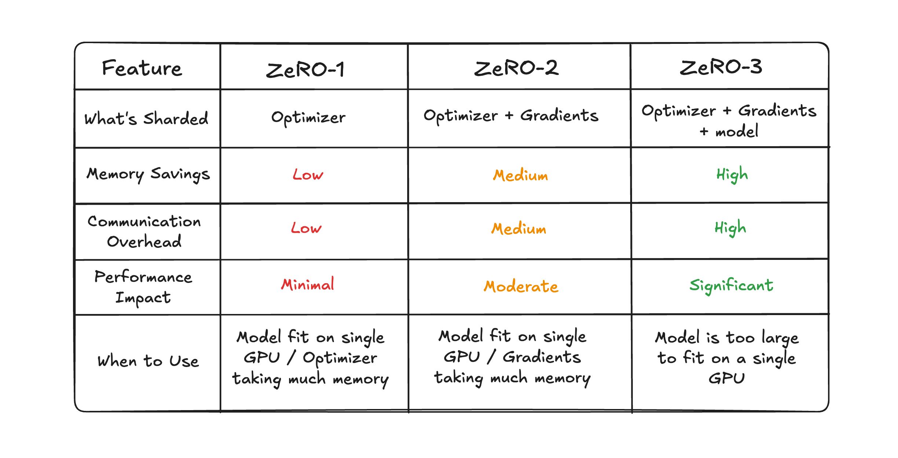

---

[⬅️ Previous - Basic Evaluation During Training ](https://app.readytensor.ai/publications/sft)
[➡️ Next - TBD](https://app.readytensor.ai/publications/multi-gpu)

---
# TL;DR
Training large models often exceeds single-GPU memory limits. DeepSpeed’s ZeRO optimizer makes this possible by **partitioning optimizer states, gradients, and parameters** across GPUs in stages (ZeRO-1, ZeRO-2, ZeRO-3).  
With Hugging Face’s `Trainer`, you can pass a **DeepSpeed config file** directly into your training arguments, enabling efficient QLoRA fine-tuning across multiple GPUs without major code changes.

---

# What You'll Learn in This Lesson
In this lesson, you’ll understand **why multi-GPU training is needed**, especially when single-GPU setups hit memory and performance limits during fine-tuning. We’ll explore **how DeepSpeed ZeRO stages differ**, breaking down ZeRO-1, ZeRO-2, and ZeRO-3 to see what each stage shards and when to use them. You’ll also learn **how to scale QLoRA fine-tuning with DeepSpeed configs**, passing them into the Hugging Face Trainer for distributed training. Finally, we’ll share **practical tips for efficiency**, including gradient checkpointing, batch accumulation strategies, and how to choose the right ZeRO stage for your hardware and workload.

---

# Why Multi-GPU Training Matters
Fine-tuning large language models often pushes beyond the **memory limitations of a single GPU**. Even with techniques like LoRA or QLoRA, larger models and longer sequence lengths can quickly exceed available VRAM, leading to out-of-memory errors or forcing very small batch sizes. By moving to multiple GPUs, training can scale to handle models that would otherwise be impossible on a single device.  

The key advantage lies in the **benefits of distributing workload**. Parameters, gradients, and optimizer states can be split across GPUs, reducing memory pressure on each device. At the same time, computation is parallelized, improving training speed and enabling more ambitious experiments. Multi-GPU setups unlock the ability to fine-tune models efficiently while keeping training stable and feasible on modern hardware.

---

# DeepSpeed ZeRO: Memory Partitioning Strategies

## Understanding What Takes Up Memory During Training

Before diving into ZeRO's solutions, it's helpful to understand what actually consumes GPU memory during fine-tuning. When training a neural network, your GPU needs to store several key components:

- **Model Parameters**: The actual weights and biases of your neural network (e.g., the billions of parameters in a large language model)
- **Gradients**: The calculated derivatives that tell us how to update each parameter to reduce the loss function
- **Optimizer States**: Additional information the optimizer (like Adam) keeps track of, such as momentum and variance estimates for each parameter

In traditional training, each GPU holds a complete copy of all three components. For large models, this quickly exhausts available memory, even with techniques like LoRA that reduce the number of trainable parameters.

## The ZeRO Solution

DeepSpeed introduces **ZeRO (Zero Redundancy Optimizer)** to overcome GPU memory limits by partitioning these model states across devices. Instead of replicating everything on each GPU, ZeRO splits them into shards, progressively reducing memory usage as you move through its stages.  

## ZeRO-1: Optimizer State Sharding
At this stage, **only optimizer states are sharded** across GPUs. Each device keeps a full copy of the model parameters and gradients but stores only part of the optimizer states.  
**When to use:** ZeRO-1 is best for smaller models or when optimizer states dominate memory usage but parameters and gradients still fit on each GPU.  

**Config Example:**
```json
{
  "train_batch_size": "auto",
  "gradient_accumulation_steps": "auto",
  "fp16": {
    "enabled": true
  },
  "zero_optimization": {
    "stage": 1, 
    "allgather_partitions": true,
    "reduce_bucket_size": 500000000,
    "overlap_comm": true
  }
}
```


## ZeRO-2: Optimizer + Gradient Sharding
Building on ZeRO-1, this stage shards both optimizer states and gradients. Each GPU still holds a full copy of the model parameters but now saves additional memory by splitting gradients.
Benefits over ZeRO-1: Significantly reduces memory usage while still maintaining relatively low communication costs.
Use cases: Ideal when gradient memory is the primary bottleneck and you want a balance between efficiency and speed.

**Config Example:**
```json
{
  "train_batch_size": "auto",
  "gradient_accumulation_steps": "auto",
  "fp16": {
    "enabled": true
  },
  "zero_optimization": {
    "stage": 2,
    "allgather_partitions": true,
    "reduce_scatter": true,
    "contiguous_gradients": true
  }
}
```


## ZeRO-3: Full Parameter Partitioning
The most aggressive stage — ZeRO-3 shards everything: parameters, gradients, and optimizer states. No GPU holds a full copy of the model; all states are partitioned across devices.
Trade-offs: This unlocks the ability to train very large models, but it comes at the cost of higher communication overhead between GPUs. It’s powerful but can be slower in practice without high-bandwidth interconnects.

**Config Example:**
```json
{
    "train_batch_size": "auto",
    "gradient_accumulation_steps": "auto",
    "fp16": {
        "enabled": "auto"
    },
    "zero_optimization": {
        "stage": 3,
        "allgather_partitions": true,
        "reduce_scatter": true,
        "contiguous_gradients": true
    }
}
```


## DeepSpeed/ZeRO Parameter Reference (Quick Guide)

- stage (1 | 2 | 3)
  - What it does: Chooses how much to split across GPUs (1=optimizer states, 2=+gradients, 3=+parameters).
  - Higher value: More memory saved, more GPU-to-GPU communication required.
  - Lower value: Less memory saved, faster and simpler.

- allgather_partitions (boolean)
  - What it does: Efficiently collects the needed pieces from other GPUs when computing.
  - If true: Uses optimized collective ops; typically faster on multi-GPU.
  - If false: Uses simpler/fallback comm paths; sometimes chosen for compatibility/debugging on certain fabrics at the cost of throughput.

- reduce_scatter (boolean)
  - What it does: Efficiently distributes reduced gradients back to the GPUs that own them.
  - If true: Bandwidth-efficient gradient exchange; best for 4+ GPUs and larger models.
  - If false: Falls back to all-reduce; acceptable on tiny models or 2-GPU setups where complexity outweighs gains.

- contiguous_gradients (boolean)
  - What it does: Packs gradients in memory contiguously to speed up transfers.
  - If true: Faster, more predictable communication; small extra packing work.
  - If false: Skips packing (slower comms), but can reduce transient memory spikes during packing on very tight memory budgets.

- overlap_comm (boolean)
  - What it does: Overlaps communication with computation to hide latency.
  - If true: Comm happens while computing; usually higher throughput.
  - If false: Sequentializes work; can improve determinism/profiling and avoid interference on bandwidth-saturated systems.

- reduce_bucket_size (number of bytes, e.g., 500000000)
  - What it does: Size of gradient "packages" sent between GPUs.
  - Increase: Fewer, larger transfers → less overhead, more temporary memory; best on fast interconnects (e.g., NVLink).
  - Decrease: More, smaller transfers → more overhead, lower memory; safer on slower interconnects (e.g., PCIe).

- fp16.enabled (boolean | "auto")
  - What it does: Enables half-precision for lower memory and faster math.
  - If true: Mixed precision on; lower memory and higher speed, with small precision trade-offs.
  - If false: Full FP32; more stable numerics but slower and higher memory use.
  - If "auto": Let DeepSpeed choose; useful to avoid mismatches across different GPUs.

- train_batch_size | gradient_accumulation_steps (often "auto")
  - What they do: Control effective batch size within memory budget.
  - Higher batch size / lower accumulation: More memory, potentially faster.
  - Lower batch size / higher accumulation: Less memory, potentially slower.

Use this reference while picking a ZeRO stage: turn on the boolean optimizations for best performance, and tune reduce_bucket_size to match your interconnect speed and memory headroom.

## ZeRO Stage Comparison Table



# Scaling QLoRA with DeepSpeed
While QLoRA makes fine-tuning large models memory-efficient, running on a single GPU can still become a bottleneck for very large models or long sequences. With DeepSpeed, you can scale to multiple GPUs by simply passing a ZeRO config file into Hugging Face’s Trainer.

## Single-GPU QLoRA Setup
A typical single-GPU setup uses standard training arguments:

```python
# Standard single-GPU training arguments
training_args = TrainingArguments(
    output_dir=output_dir,
    num_train_epochs=1,
    learning_rate=2e-4,
    fp16=True,
    per_device_train_batch_size=2,
    gradient_accumulation_steps=4,
)
```

## Multi-GPU QLoRA with DeepSpeed
To enable multi-GPU training, simply add the DeepSpeed config file to your training arguments:

```python
# Multi-GPU training arguments with DeepSpeed
training_args = TrainingArguments(
    output_dir=output_dir,
    num_train_epochs=1,
    learning_rate=2e-4,
    fp16=True,
    per_device_train_batch_size=2,
    gradient_accumulation_steps=4,
    deepspeed="zero2.json",  # <-- Only difference: add DeepSpeed config
    gradient_checkpointing=True
)
```

The model setup, LoRA configuration, and trainer initialization remain exactly the same. DeepSpeed automatically handles the multi-GPU coordination based on your chosen config file (zero1.json, zero2.json, or zero3.json).

# Practical Tips for Multi-GPU Training
Scaling across multiple GPUs introduces new decisions and trade-offs. To get the best efficiency out of your setup, it’s important to tune both the memory strategy and the training loop.

Choosing the right ZeRO stage is the first step. ZeRO-1 works well when optimizer states dominate memory, ZeRO-2 is usually the sweet spot for most fine-tuning runs, and ZeRO-3 is best reserved for very large models where parameters themselves cannot fit on a single GPU.

Gradient checkpointing trades extra compute for lower memory usage, allowing larger sequence lengths or batch sizes.

**Batch size + accumulation**: balance throughput and memory. Use accumulation when GPUs can’t handle large batches directly.

**Interconnect bandwidth matters**: ZeRO-3 works best on fast links like NVLink. On PCIe-only setups, communication overhead can slow training.

**Monitor performance**: check DeepSpeed logs or tools like Weights & Biases to see if your bottleneck is compute, memory, or communication.

## 🎥 Video: Multi-GPU Training with DeepSpeed in Action

*[VIDEO PLACEHOLDER - This section will contain a comprehensive demonstration showing:]*

*- Live setup of multi-GPU training with DeepSpeed ZeRO configurations*
*- Monitoring GPU memory usage and communication patterns across stages*
*- Hands-on parameter tuning for different interconnect speeds*

*The video will demonstrate the practical differences between ZeRO stages with real training runs, helping you understand when to choose each configuration based on your hardware and model requirements.*

# 🎥 Reflect and Test Your Understanding

Consider these multi-GPU training scenarios and think through how you would approach each:

1. **Memory Bottleneck Decision**: You're fine-tuning a 13B parameter model on 4x A40 GPUs (48GB each). With ZeRO-1, training runs but uses 95% of memory with batch size 1. With ZeRO-2, you can use batch size 2 but training is 20% slower. Which would you choose and why? What other parameters might you adjust?

2. **Interconnect Trade-offs**: You have access to two setups: 2x A100 GPUs with NVLink (600GB/s), or 8x RTX 3090 GPUs with PCIe (16GB/s). Your model is 7B parameters. How would your ZeRO stage choice and DeepSpeed config differ between these setups?

3. **Debugging Slow Training**: Your 4-GPU ZeRO-3 training is running 3x slower than expected. The logs show high communication overhead. What parameters would you investigate and potentially modify to diagnose and fix the issue?

Think through these scenarios considering memory constraints, interconnect bandwidth, and the trade-offs between the different ZeRO stages and configuration parameters.

## Key Takeaways

- **DeepSpeed ZeRO partitions memory components across GPUs** - ZeRO-1 shards optimizer states, ZeRO-2 adds gradients, ZeRO-3 adds parameters
- **ZeRO-2 is the sweet spot for most fine-tuning** - balances memory savings with communication overhead
- **Fast interconnects are critical for ZeRO-3** - NVLink works well, PCIe can bottleneck performance
- **Boolean parameters control communication optimizations** - typically set to true, but false can help with debugging or edge cases
- **reduce_bucket_size trades off latency and memory** - larger for fast interconnects, smaller for slower connections
- **Multi-GPU scaling is trivial with Hugging Face Trainer** - just add deepspeed="config.json" to training arguments
- **Monitor your bottlenecks** - watch for compute, memory, or communication constraints to optimize effectively

DeepSpeed makes multi-GPU training accessible without requiring deep distributed computing expertise. Understanding the ZeRO stages and their trade-offs lets you efficiently scale fine-tuning to models that wouldn't fit on a single GPU.


---

[⬅️ Previous - Basic Evaluation During Training ](https://app.readytensor.ai/publications/sft)
[➡️ Next - TBD](https://app.readytensor.ai/publications/multi-gpu)

---